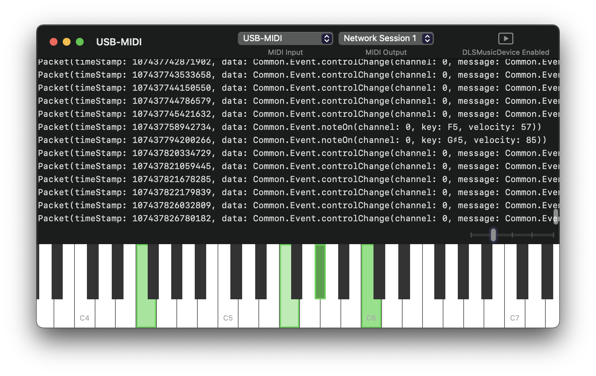

# Resonance

<h3 align="center">
  
</h3>

## Build

<!-- disable actions as macOS-latest is not so much latest:  -->

`Resonance` target is for Mac app. `Resonance-ios` target is for iOS app.

## Usage

Attach a MIDI interface to Mac and select as MIDI input.

With `Audio MIDI Setup.app` at `/Applications/Utilities/`, MIDI can be routed to other Macs, iPhones and/or iPads. (MIDI events can also be shared among devices with a single interface.)

## Contributing

Any feedbacks and pull requests are welcome.

## More Info

development thread on twitter: <https://twitter.com/banjun/status/1388485555290214401>
